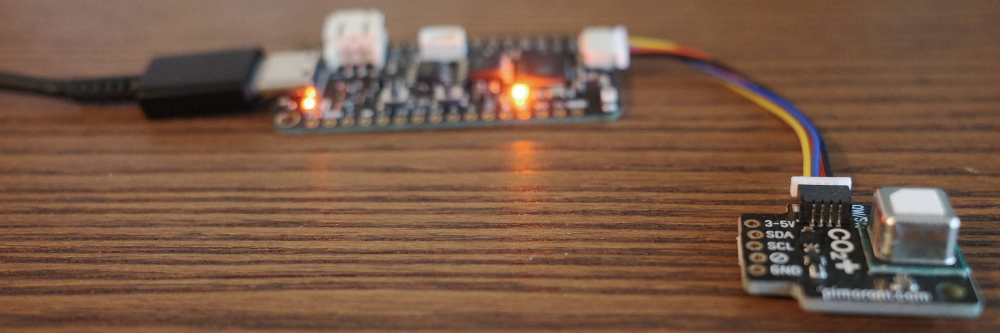

# About
## Hardware Setup
- [Sensirion SCD40](https://sensirion.com/products/catalog/SCD40) - a photoacoustic sensor measuring CO2 levels with an accuracy of ±50 ppm in the range 0-40000 ppm
- [Feather S3](https://learn.adafruit.com/adafruit-esp32-s3-feather/overview) - a microcontroller with WiFi and Bluetooth support

## Software 
-
## Development information
The microcontroller is constrained and slow, so if you are a bit more impatient during development, I recommend to work in some workspace on your own computer and then sync the folder to the microcontroller, e.g. using `cp` or `rsync`:
#### Sync on Linux:
```bash
cp -R --exclude='README*' --exclude='.Trashes' --exclude='.fseventsd' --exclude='.metadata_never_index' --exclude='.Spotlight-V100' ~/git/co2sensor/* /Volumes/CIRCUITPY/
```

#### Sync on macOS:
```bash
cp -R ~/git/co2sensor/* /Volumes/CIRCUITPY/ 2>/dev/null`
```

## CO2 levels 
[Source](https://www.kane.co.uk/knowledge-centre/what-are-safe-levels-of-co-and-co2-in-rooms)

| CO₂ Concentration | Effects |
|-------------------|----------|
| 250-400 ppm | Normal background concentration in outdoor ambient air |
| 400-1,000 ppm | Concentrations typical of occupied indoor spaces with good air exchange |
| 1,000-2,000 ppm | Complaints of drowsiness and poor air |
| 2,000-5,000 ppm | Headaches, sleepiness and stagnant, stale, stuffy air. Poor concentration, loss of attention, increased heart rate and slight nausea may also be present |
| 5,000 ppm | Workplace exposure limit (as 8-hour TWA) in most jurisdictions |
| >40,000 ppm | Exposure may lead to serious oxygen deprivation resulting in permanent brain damage, coma, even death |
